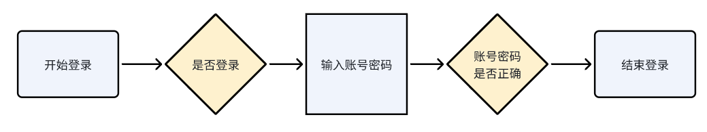

# 购物商城H5
## 说明
仅用于demo 展示，所有数据均为mock 数据，目前仅支持H5

## 技术栈
vue3 + vite + vuex + vue-router + mockjs

## 版本要求
node 16+

## 安装部署
```bash
// 安装
npm install

// 启动
npm run dev

// 部署
npm run build

// nginx，输出dist，nginx 指向index.html
```

## 业务页面
1. 登录页面
2. 主页面（商品列表）
3. 单个商品详情
4. 购物车
5. 个人信息
6. 我的订单（全部订单）
7. 收货地址管理
8. 新增收货地址

## 登录流程

## 购买流程

## 代码目录结构
```
shop-project
├─ src
│  ├─ assets          
│  │  ├─ img
│  │  │  ├─ banner           轮播banner
│  │  │  ├─ login            登录背景图
│  │  │  └─ product          商品图
│  ├─ components            
│  │  ├─ backHeader          顶部返回组件             
│  │  ├─ home
│  │  │  ├─ productItem.vue  单个商品组件
│  │  │  ├─ searchBar.vue    搜索框组件
│  │  │  └─ swipeBanner.vue  轮播图
│  │  ├─ loginFloat          登录提示悬浮框
│  │  └─ tabbar              底部tabbar
│  ├─ http                   请求service
│  ├─ interface
│  ├─ main.js
│  ├─ mock                   mock 数据
│  ├─ plugin                 
│  │  └─ axios.js   
│  ├─ router                 
│  ├─ store
│  ├─ style.css
│  ├─ styles
│  ├─ utils                  公用方法
│  │  ├─ crypto.js           加解密公用方法
│  │  ├─ status.ts           网络状态码
│  │  └─ utils.js
│  ├─ views
│  │  ├─ address             收货地址管理
│  │  │  ├─ edit.vue         新增收货地址
│  │  │  ├─ index.scss
│  │  │  └─ index.vue
│  │  ├─ error               错误页面
│  │  │  ├─ 404.vue
│  │  │  └─ NoPermission.vue
│  │  ├─ home                主页面（商品列表）
│  │  ├─ index.vue
│  │  ├─ layout              最外层layout
│  │  ├─ login               登录
│  │  ├─ mine                个人信息
│  │  ├─ order               我的订单
│  │  ├─ product             商品详情
│  │  └─ shopCart            购物车
│  └─ vite-env.d.ts
└─ vite.config.ts

```